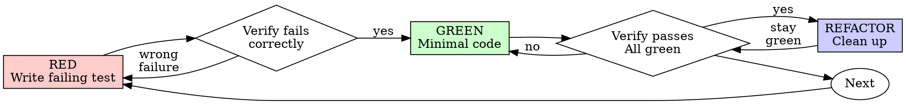

# Test-Driven Development (TDD)

## Overview

Write the test first. Watch it fail. Write minimal code to pass.

**Core principle:** If you didn't watch the test fail, you don't know if it tests the right thing.

Use this skill when TDD will buy meaningful confidence, not as a ritual for every tiny edit.

## When to Use

**Use by default for:**
- New features
- Bug fixes
- Behavior changes

**Use especially for:**
- Core or user-visible flows
- Risky logic changes
- Regression fixes
- Code that is hard to validate confidently by inspection alone

**May be unnecessary or lighter-weight for:**
- Throwaway prototypes
- Generated code
- Configuration files

**May not need full TDD ceremony for:**
- Small mechanical edits with low behavioral risk

If the change is important enough that failure would matter, prefer TDD.

## The Iron Law

```
WHEN USING TDD, NO BEHAVIORAL IMPLEMENTATION BEFORE A FAILING TEST FIRST
```

If you've already written the implementation for a task that should have been test-driven, stop and decide whether to back up and add a proper failing test before continuing. Do not just wave it through without evidence.

## Red-Green-Refactor



### RED - Write Failing Test

Write one minimal test showing what should happen.

<Good>
```typescript
test('retries failed operations 3 times', async () => {
  let attempts = 0;
  const operation = () => {
    attempts++;
    if (attempts < 3) throw new Error('fail');
    return 'success';
  };

  const result = await retryOperation(operation);

  expect(result).toBe('success');
  expect(attempts).toBe(3);
});
```
Clear name, tests real behavior, one thing
</Good>

<Bad>
```typescript
test('retry works', async () => {
  const mock = jest.fn()
    .mockRejectedValueOnce(new Error())
    .mockRejectedValueOnce(new Error())
    .mockResolvedValueOnce('success');
  await retryOperation(mock);
  expect(mock).toHaveBeenCalledTimes(3);
});
```
Vague name, tests mock not code
</Bad>

**Requirements:**
- One behavior
- Clear name
- Real code (no mocks unless unavoidable)

### Verify RED - Watch It Fail

**MANDATORY. Never skip.**

```bash
npm test path/to/test.test.ts
```

Confirm:
- Test fails (not errors)
- Failure message is expected
- Fails because feature missing (not typos)

**Test passes?** You're testing existing behavior. Fix test.

**Test errors?** Fix error, re-run until it fails correctly.

### GREEN - Minimal Code

Write simplest code to pass the test.

<Good>
```typescript
async function retryOperation<T>(fn: () => Promise<T>): Promise<T> {
  for (let i = 0; i < 3; i++) {
    try {
      return await fn();
    } catch (e) {
      if (i === 2) throw e;
    }
  }
  throw new Error('unreachable');
}
```
Just enough to pass
</Good>

<Bad>
```typescript
async function retryOperation<T>(
  fn: () => Promise<T>,
  options?: {
    maxRetries?: number;
    backoff?: 'linear' | 'exponential';
    onRetry?: (attempt: number) => void;
  }
): Promise<T> {
  // YAGNI
}
```
Over-engineered
</Bad>

Don't add features, refactor other code, or "improve" beyond the test.

### Verify GREEN - Watch It Pass

**MANDATORY.**

```bash
npm test path/to/test.test.ts
```

Confirm:
- Test passes
- Other tests still pass
- Output pristine (no errors, warnings)

**Test fails?** Fix code, not test.

**Other tests fail?** Fix now.

### REFACTOR - Clean Up

After green only:
- Remove duplication
- Improve names
- Extract helpers

Keep tests green. Don't add behavior.

### Repeat

Next failing test for next feature.

## Good Tests

| Quality | Good | Bad |
|---------|------|-----|
| **Minimal** | One thing. "and" in name? Split it. | `test('validates email and domain and whitespace')` |
| **Clear** | Name describes behavior | `test('test1')` |
| **Shows intent** | Demonstrates desired API | Obscures what code should do |

## Why Order Matters

**"I'll write tests after to verify it works"**

Tests written after code often pass immediately. Passing immediately proves much less than a clean red-green cycle:
- Might test wrong thing
- Might test implementation, not behavior
- Might miss edge cases you forgot
- You never saw it catch the bug

Test-first forces you to see the test fail, proving it actually tests something. That matters most on behavior-critical work.

**"I already manually tested all the edge cases"**

Manual testing is ad-hoc. You think you tested everything but:
- No record of what you tested
- Can't re-run when code changes
- Easy to forget cases under pressure
- "It worked when I tried it" ≠ comprehensive

Automated tests are systematic. They run the same way every time.

**"Adding tests after is good enough"**

Sometimes it is acceptable to add tests after implementation, but only when the task is low-risk enough that full TDD would be disproportionate. For important behavior changes, tests-after still loses the strongest proof that the test actually catches the bug or requirement.

The goal is not ritual purity. The goal is confidence proportional to risk.

**"TDD is dogmatic, being pragmatic means adapting"**

TDD IS pragmatic:
- Finds bugs before commit (faster than debugging after)
- Prevents regressions (tests catch breaks immediately)
- Documents behavior (tests show how to use code)
- Enables refactoring (change freely, tests catch breaks)

Pragmatism means choosing TDD where it buys real confidence, not skipping it on the changes that need it most.

**"Tests after achieve the same goals - it's spirit not ritual"**

No. Tests-after answer "What does this do?" Tests-first answer "What should this do?"

Tests-after are biased by your implementation. You test what you built, not what's required. You verify remembered edge cases, not discovered ones.

Tests-first force edge case discovery before implementing. Tests-after verify you remembered everything (you didn't).

Tests-after can still add value, but they are not a full substitute for TDD on high-risk behavioral work.

## Common Rationalizations

| Excuse | Reality |
|--------|---------|
| "Too simple to test" | Maybe. Decide based on risk, not habit. |
| "I'll test after" | Sometimes acceptable for low-risk work, weak evidence for critical behavior. |
| "Tests after achieve same goals" | Not for high-risk behavior changes. |
| "Already manually tested" | Manual testing is weak regression protection. |
| "Need to explore first" | Fine. But once behavior matters, add real tests. |
| "Test hard = design unclear" | Often true; use that signal. |
| "TDD will slow me down" | Often false on risky work. |
| "Existing code has no tests" | Improve confidence where you're changing behavior. |

## Red Flags

- Skipping tests on a behavior-critical change
- Test added after implementation with no good reason on risky work
- Test passes immediately and you cannot show it would have caught the issue
- Can't explain why the chosen testing strategy is sufficient for the task's risk
- Relying only on manual testing for a regression-prone path

These are signs to slow down and reconsider whether the task should be handled with proper TDD.

## Example: Bug Fix

**Bug:** Empty email accepted

**RED**
```typescript
test('rejects empty email', async () => {
  const result = await submitForm({ email: '' });
  expect(result.error).toBe('Email required');
});
```

**Verify RED**
```bash
$ npm test
FAIL: expected 'Email required', got undefined
```

**GREEN**
```typescript
function submitForm(data: FormData) {
  if (!data.email?.trim()) {
    return { error: 'Email required' };
  }
  // ...
}
```

**Verify GREEN**
```bash
$ npm test
PASS
```

**REFACTOR**
Extract validation for multiple fields if needed.

## Verification Checklist

Before marking work complete:

- [ ] Every new function/method has a test
- [ ] Watched each test fail before implementing
- [ ] Each test failed for expected reason (feature missing, not typo)
- [ ] Wrote minimal code to pass each test
- [ ] All tests pass
- [ ] Output pristine (no errors, warnings)
- [ ] Tests use real code (mocks only if unavoidable)
- [ ] Edge cases and errors covered

Can't check all boxes on a task that needed TDD? Reassess before claiming strong confidence.

## When Stuck

| Problem | Solution |
|---------|----------|
| Don't know how to test | Write wished-for API. Write assertion first. Ask your human partner. |
| Test too complicated | Design too complicated. Simplify interface. |
| Must mock everything | Code too coupled. Use dependency injection. |
| Test setup huge | Extract helpers. Still complex? Simplify design. |

## Debugging Integration

Bug found? Prefer a failing test that reproduces it. Follow the TDD cycle when the bug matters enough to deserve regression protection.

## Testing Anti-Patterns

When adding mocks or test utilities, read @testing-anti-patterns.md to avoid common pitfalls:
- Testing mock behavior instead of real behavior
- Adding test-only methods to production classes
- Mocking without understanding dependencies

## Final Rule

```
Production code → test exists and failed first
Otherwise → not TDD
```

Use TDD where confidence matters. When you choose not to use it, that should be a conscious scope and risk decision, not inertia.
